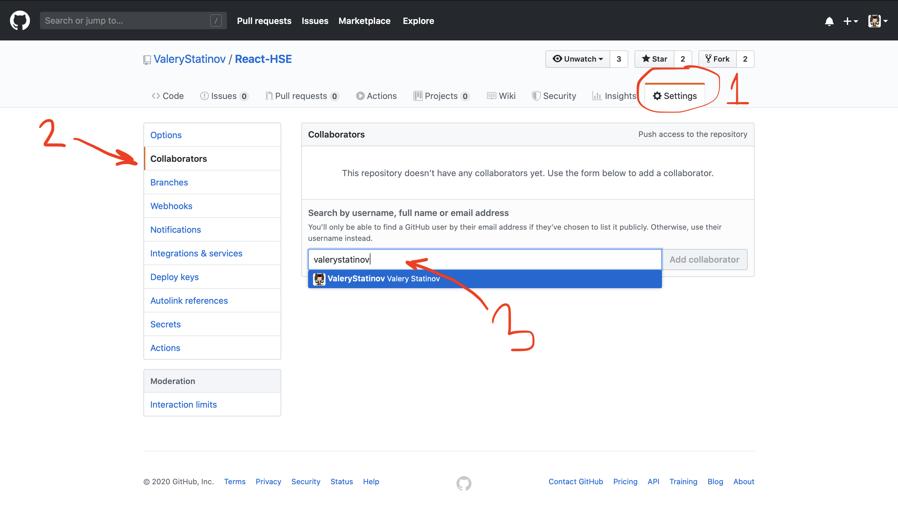
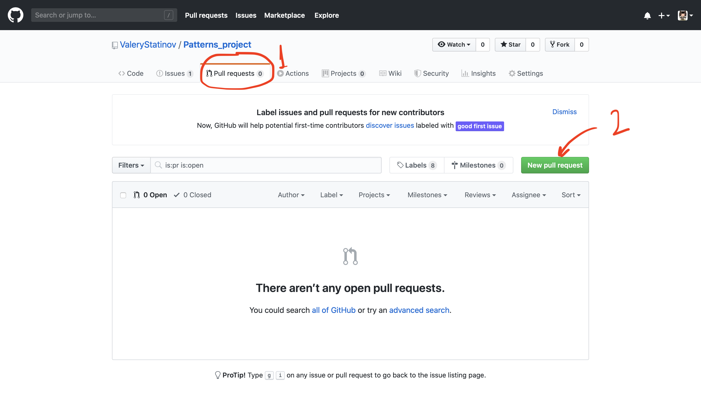

## Создание Pull Request'a на GitHub

1. Добавть меня в свой репозиторий (лучше сделать заранее)

    Для этого нужно зайти в раздел репозитория `Settings` (1) -> `Collaborators` (2), ввести `valerystatinov` (3) и выслать мне инвайт в репозиторий.
    

2. Выполнение задания в отдельной ветке

    Находясь в корне проекта, убедиться, что вы находитесь на ветке `master`, используя команду
    ```
    git status
    ```

    Переключится на новую ветку, введя команду
    ```
    git checkout -b <BRANCH NAME>
    ```

    Выполнить задание, написав весь необходимый код. 
    
    После этого код нужно закоммитить, выполнив команды
    ```bash
    # с помощью знака # в bash обозначаются комментарии

    git add . # указываем, что ВСЕ измененные файлы будут закоммичены

    git commit # После выполнения этой команды вам будет предложено ввести сообщение, поясняющее что сделано в этом коммите

    git push origin HEAD # пушим новую ветку с изменениями в репозиторий на гитхабе
    ```
    После этого ваш новый код появится на гитхабе


3. Создание Pull Request'a (далее PR)

    Зайти в раздел `Pull requests` (1) и нажать `New pull request` (2). 

    Далее в качестве base нужно выбрать ветку `master`, а для compare вашу ветку. Нажать кнопку `Create pull request`.

    В появившихся окнах ввести название и краткое описание PR. Справа в разделе reviewers назначить меня (это действие возможно только если я уже принял инвайт). Снова нажимаем на `Create pull request`.

    Если добавть в reviewers не удалось, то нужно тегнуть меня в комментариях созданного PR, оставив комментарий с текстом `@valerystatinov`.