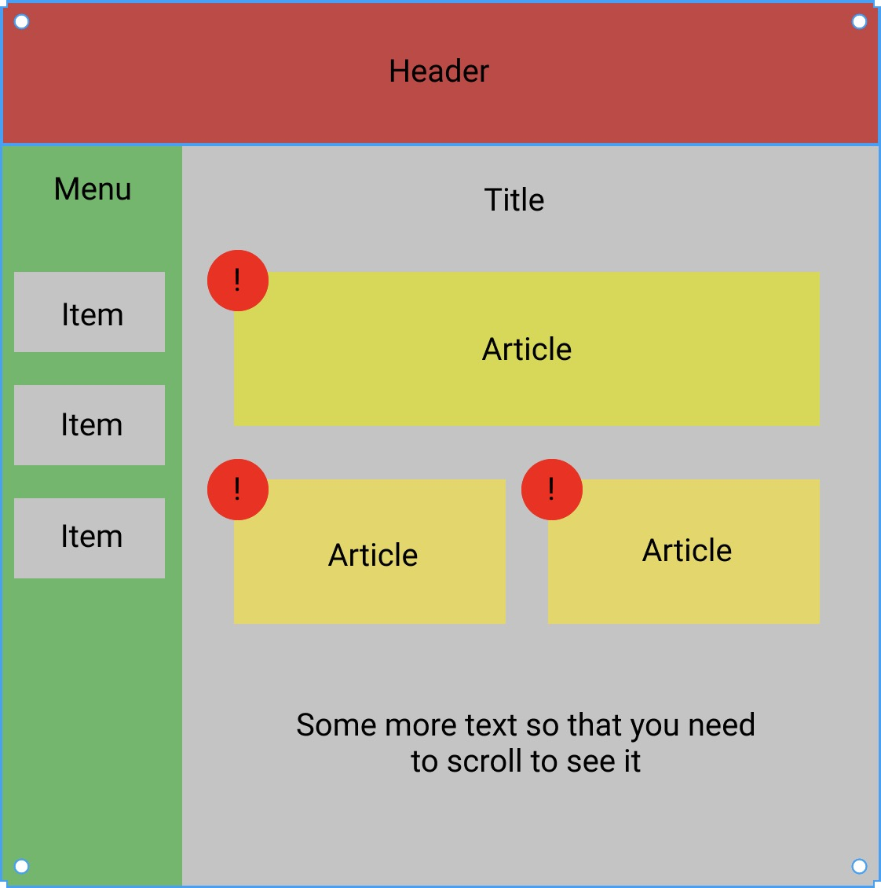

# React-HSE
<br>

## Домашние задания
### **ДЗ 1** - deadline 23:59 04.02
Сверстать макет, прикрепленный ниже. Header и Menu должны всега присутствовать на экране и не двигаться при прокрутке. Все цвета, отступы и тд выбираете сами, макет примерный.
Для сдачи задания нужно отправить письмо на valery.statinov@gmail.com, указав тему письма «React ВШЭ ДЗ_1» без ковычек, приложить к письму два файла: .html и .css (да, для сдачи этого задания не нужен гит).



### **ДЗ 2** - no deadline
Настоить рабочее окружение и попробовать создать Hello world проект.
Для пользователей Windows - https://www.liquidweb.com/kb/install-react-js-windows/

Для пользователей Linux
```
curl -sL https://deb.nodesource.com/setup_12.x | sudo -E bash -
sudo apt-get install nodejs
```
После этого у вас будет установлен NodeJS, npm и npx. Для создания проекта:
```
npx create-react-app name-of-your-app
```
После этого появится директория `name-of-your-app`, в которой содержится настроенный Hello world проект. Для запуска:
```
cd name-of-your-app
npm run start
```

Далее нужно создать репозиторий на GitHub (или GitLab/Bitbucket/...) и запушить этот проект в ветку master.

Желательно сделать это до следующего занятия (12.02), так как на этом семинаре будут практические задания. По всем вопросам пишите в чат или мне в telegram.
